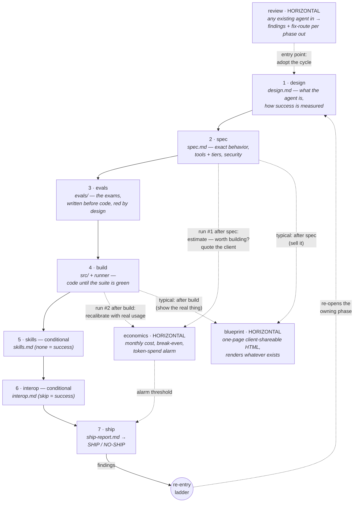

# agent-cycle

Claude Code plugin that runs the **complete construction cycle of an AI agent** —
from idea to shipped, evaluated, observable production agent — as a gated,
disk-backed pipeline of skills. Evals are written before code, artifacts are
contracts, humans gate every phase, and "the suite is green" is only ever an
exit code.

## Install

From an interactive Claude Code session:

```
/plugin marketplace add alanvaa06/agent-cycle
/plugin install agent-cycle@agent-cycle
```

Update later with `/plugin marketplace update agent-cycle` and reinstall.

## The production cycle

Seven **vertical phases** run in sequence, each gated by an approved artifact
from the previous one. Three **horizontal transversals** attach at any point —
they read whatever artifacts exist and never block the chain.



**When to run the horizontals:** `review` BEFORE the cycle (an existing agent
is the input; its remediation map is the adoption plan). `economics` twice —
right after `spec` (you now know what it does and on which model: decide
whether it is worth building / quote the client, before paying for a build)
and again after `build` (recalibrate the estimate with real usage; its alarm
threshold feeds `ship`). `blueprint` any time after `design` — typically after
`spec` to sell and after `build` to show the real thing.

**The re-entry ladder:** when anything downstream finds a defect in an
upstream artifact, the fix goes back to the *lowest phase whose artifact is
wrong* (version bump → surgical staleness → re-approve). The builder never
edits evals or specs — that path is mechanically blocked.

## The 10 skills, in plain words

### The 7 phases — in order, each needs the previous one approved

**1 · `design` — decide WHAT you want and how you'll know it works.**
It interviews you, one question at a time, and writes the blueprint. Like the
floor plan of a house before laying a single brick. Example: "an assistant
that saves me half the time I spend checking my calendar and Notion."
*Use it when:* starting a new agent from an idea. *Skip it when:* you want to
examine an agent that already exists — that's `review`.

**2 · `spec` — turn the idea into exact instructions.**
What the agent does in every situation (with concrete "if I say X, it does Y"
examples), which tools it has and how dangerous each one is, and what it must
NEVER do. *Use it when:* the design is approved. *Skip it when:* there's no
approved design yet.

**3 · `evals` — write the exams BEFORE building.**
Every behavior gets a test, including trap questions (like injection attempts
hidden in a calendar invite). All exams FAIL at first — of course they do,
the agent doesn't exist yet. An exam that passes against nothing is a broken
exam. *Use it when:* the spec is approved. *Skip it when:* you want generic
unit tests for normal code.

**4 · `build` — write the code until every exam passes.**
The only phase that produces code. "It's done" is never an opinion — it's the
exam runner saying every test passed. It also installs a lock so the builder
can't cheat by editing the exams. *Use it when:* design + spec + evals are
all approved. *Skip it when:* any of those is missing or outdated.

**5 · `skills` — does the agent need loadable "procedure manuals"?**
Think: 12 different return policies, one per client, loaded only when needed.
Most agents don't need this — and "no, here's why" is a perfectly good
outcome that gets written down. *Use it when:* the build is done. *Skip it
when:* you're writing Claude Code skills outside this pipeline.

**6 · `interop` — does the agent need to TALK to other agents?**
Real conversation: negotiating, delegating, waiting for answers. Asking an
API for data does NOT count — that's just a tool. Most agents don't need
this either; "skip, here's why" gets written down. *Use it when:* the build
is done. *Skip it when:* you just need an API integration.

**7 · `ship` — the final inspection before it goes live.**
Like a vehicle inspection: re-runs ALL the exams live (doesn't trust old
paperwork), checks security, verifies there's an off switch and a way to roll
back. Verdict: SHIP or NO-SHIP. A NO-SHIP means the system worked — it
caught something before your client did. *Use it when:* the whole chain is
approved. *Skip it when:* you want to deploy a normal app, or fix things —
this skill only inspects.

### The 3 horizontals — they never block anything, run them when it helps

**`economics` — what does it cost per month to keep it on?**
Run it TWICE. First right after `spec`: you now know what it does and which
model it uses — decide if it's worth building, or quote the client, BEFORE
paying for a build. Again after `build`: correct the estimate with real
usage. Example verdict: "$13–19/month — pays for itself if it saves you 12
minutes a month." *Skip it when:* you just want generic API price info.

**`blueprint` — the pretty one-pager.**
A single HTML page showing what the agent is, what it does, what it costs and
how far along it is. Works offline, safe to share with a client, prints
cleanly. Typical moments: after `spec` (to sell it) and after `build` (to
show the real thing). *Skip it when:* you want a generic diagram.

**`review` — the front door.**
Point it at ANY existing agent — yours or someone else's, built with this
pipeline or not — and it tells you what's missing, with file-and-line
evidence, and WHICH phase of this cycle would fix each gap. A client walks in
with their bot; walks out with a diagnosis that doubles as the proposal.
*Skip it when:* the code has no agent in it (that's normal code review), or
you want the release inspection of a pipeline agent (that's `ship`).

## Core contracts

- **Disk-backed artifacts** land in the TARGET AGENT'S repo (`docs/agent/*`,
  `evals/`, `src/`) — this plugin repo never contains agent artifacts.
- Every artifact carries frontmatter (`agent_name, version, status, date` +
  upstream version pins). Phases **fail hard** on missing, draft, or
  version-stale upstream artifacts.
- **Human gate between every phase** — no skill ever self-approves.
- **EDD everywhere**: every skill in this plugin was built evals-first against
  its own 4-case contract (`skills/*/evals/`), and teaches the same discipline
  to the agents it builds.

## Versioning

Semver, driven by `.claude-plugin/plugin.json`:

- **minor** — a new pipeline skill lands.
- **patch** — fixes to existing skills or docs.
- Each skill also graduates via its own eval gate (see `skills/*/evals/`);
  graduation is tagged (`<skill>-v0.1`) independently of plugin releases.

See `CHANGELOG.md` for release history.

**Status:** v0.10.0 — all 7 phases + 3 transversals. 10 skills. Built
skill-by-skill, each dogfooded on a real agent.
