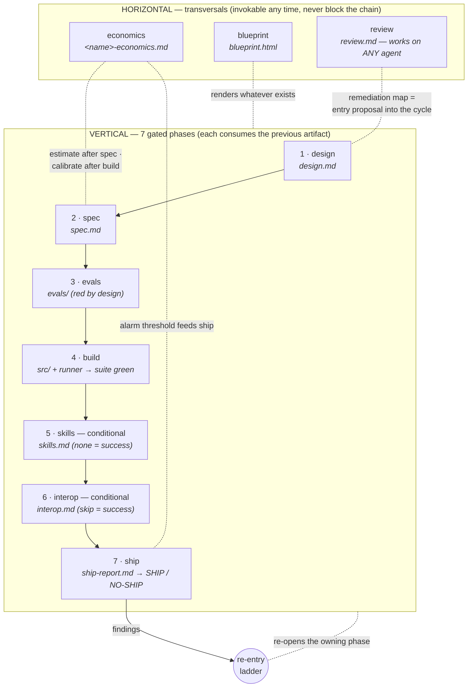

# agent-cycle

Claude Code plugin that runs the **complete construction cycle of an AI agent** —
from idea to shipped, evaluated, observable production agent — as a gated,
disk-backed pipeline of skills. Evals are written before code, artifacts are
contracts, humans gate every phase, and "the suite is green" is only ever an
exit code.

## Install

From an interactive Claude Code session:

```
/plugin marketplace add alanvaa06/agent-cycle
/plugin install agent-cycle@agent-cycle
```

Update later with `/plugin marketplace update agent-cycle` and reinstall.

## The production cycle

Seven **vertical phases** run in sequence, each gated by an approved artifact
from the previous one. Three **horizontal transversals** attach at any point —
they read whatever artifacts exist and never block the chain.



**The re-entry ladder:** when anything downstream finds a defect in an
upstream artifact, the fix goes back to the *lowest phase whose artifact is
wrong* (version bump → surgical staleness → re-approve). The builder never
edits evals or specs — that path is mechanically blocked.

## The 10 skills

### Vertical phases

| # | Skill | What it does | Use when | Do NOT use for |
|---|---|---|---|---|
| 1 | **`design`** | Interviews you (one question at a time) into an approvable `design.md`: PEAS with a Goodhart-tested environment metric, environment classification → architecture implications, single-agent-default harness, deployment intent + 3 portability seams, NO-goals. | Starting a NEW agent from an idea — "design an agent for X". | Reviewing existing agents (that is `review`); writing specs/evals/code (later phases). |
| 2 | **`spec`** | Turns the approved design into an executable spec: Gherkin scenarios with `BHV-NNN` ids (happy/wrong/edge per capability), final tool contracts (docstring-as-interface, `extra="forbid"`, action tiers), conversation rules, per-surface security with mandatory injection scenarios, data schemas, traceability table. Interviews ONLY on the design's open questions — the design is settled law. | The design is approved and you want the blueprint — "write the spec". | Running without an approved design; generic BDD/Gherkin help; evals or code. |
| 3 | **`evals`** | Builds the eval suite BEFORE any code exists: golden cases pinning `BHV-NNN@version`, method mix (deterministic / LLM-judge with anchored rubrics / adversarial per untrusted surface incl. the end-user's language), per-tier thresholds (pass^k for destructive), release blockers lifted verbatim from the spec. The suite is pure data — red by design until build. | The spec is approved — "build the evals". | Running without an approved spec; writing runners or agent code (build's job); generic unit-test writing. |
| 4 | **`build`** | The only code-producing phase: scaffolds the SPEC's runtime (the plugin has no favorite framework), core/adapter split over 5 bindings, installs the anti-gaming hook BEFORE the first source file, builds the eval RUNNER whose exit code is the pipeline's definition of green, emits OTel telemetry incl. token counters, delegates non-trivial builds to forge-master via a mechanically derived PRD (two human gates). | Design+spec+evals all approved — "build the agent". | Running on a stale chain; generic app development; modifying evals or specs (frozen; re-entry ladder). |
| 5 | **`skills`** *(conditional)* | Entry test per capability: does anything need on-demand procedural know-how, or do tools + static instructions suffice? "None" is a recorded successful outcome with re-visit triggers. When warranted: EDD-first authoring, routing-grade descriptions, ≥90% measured trigger accuracy co-loaded, draft→action authority ladder. | Post-build — "does the agent need skills?" | Running without an approved build; authoring Claude Code skills outside the pipeline; the agent's TOOLS (spec's domain). |
| 6 | **`interop`** *(strongly conditional)* | Per-relationship entry test: does the counterpart return a RESULT (tool/MCP — phase does not apply) or take RESPONSIBILITY (A2A)? Skip is the expected, recorded outcome. When warranted: Agent Card, counterpart-security (remote agents are untrusted; tiers travel; delegation never bypasses HITL), executor binding, registry decision. | Post-build — "does the agent need A2A?" | Generic API/webhook integrations (tool territory); MCP server authoring. |
| 7 | **`ship`** | The closing mechanical audit: full-chain gate, the suite RE-RUN live (build.md is claim, not evidence), traceability, security re-verification (least-privilege diff, secret scan incl. git history, ingress spot-checks), anti-gaming word-diff over the build's commit range, observability + economics-threshold alarm checks, runbook verification, explicit SHIP / NO-SHIP verdict with re-entry routes. The auditor writes ONE file and fixes nothing. | The full chain is approved — "run the ship audit". | Generic deployment (Vercel/hosting); arbitrary-agent assessment (that is `review`); fixing anything. |

### Horizontal transversals

| Skill | What it does | Use when | Do NOT use for |
|---|---|---|---|
| **`economics`** | Monthly cost analysis: dated unit prices (user figures → provider pages via web → UNKNOWN; free tiers checked before headline rates), tokens-first scenario model with auditable formulas and band totals, sensitivity (tier swap + volume + caching), break-even (client price or the design's own metric monetized), token-spend alarm threshold as the contract with `ship`, calibration mode with delta tables. | Design approved, any time after — "what will this agent cost?"; recalibrate with real usage post-build. | Generic API pricing questions; billing questions about existing accounts. |
| **`blueprint`** | One self-contained, client-shareable HTML snapshot rendered progressively from whatever artifacts exist: PEAS/harness, tier-colored tools, security surfaces, eval coverage, economics embedded verbatim, pipeline progress bar, ship verdict when present. Zero external references, zero required JS, print-ready, sanitized (env names yes, values never). A dated photo — regenerable, no approval status of its own. | Design approved, any time — "generate the blueprint" / the client one-pager. | Generic diagramming; recomputing economics or re-running evals (it renders artifacts verbatim). |
| **`review`** | Assesses ANY existing agent — pipeline-born or foreign — across 8 dimensions (specification/Goodhart, contracts & tiers, security from REAL inputs, loop caps, evals-or-hope, observability, economics, ops). Evidence is file:line or explicit "not found" — invented architecture is banned. Every finding: severity + the pipeline phase that fixes it; the remediation map doubles as the entry proposal into the cycle. The ONE chain-gate-free skill; read-only on the target. | Any existing agent/bot/orchestration code — "review this agent". The agency front door. | Non-agent code review; the release audit of a pipeline-born agent (that is `ship`); fixing anything. |

## Core contracts

- **Disk-backed artifacts** land in the TARGET AGENT'S repo (`docs/agent/*`,
  `evals/`, `src/`) — this plugin repo never contains agent artifacts.
- Every artifact carries frontmatter (`agent_name, version, status, date` +
  upstream version pins). Phases **fail hard** on missing, draft, or
  version-stale upstream artifacts.
- **Human gate between every phase** — no skill ever self-approves.
- **EDD everywhere**: every skill in this plugin was built evals-first against
  its own 4-case contract (`skills/*/evals/`), and teaches the same discipline
  to the agents it builds.

## Versioning

Semver, driven by `.claude-plugin/plugin.json`:

- **minor** — a new pipeline skill lands.
- **patch** — fixes to existing skills or docs.
- Each skill also graduates via its own eval gate (see `skills/*/evals/`);
  graduation is tagged (`<skill>-v0.1`) independently of plugin releases.

See `CHANGELOG.md` for release history.

**Status:** v0.10.0 — all 7 phases + 3 transversals. 10 skills. Built
skill-by-skill, each dogfooded on a real agent.
